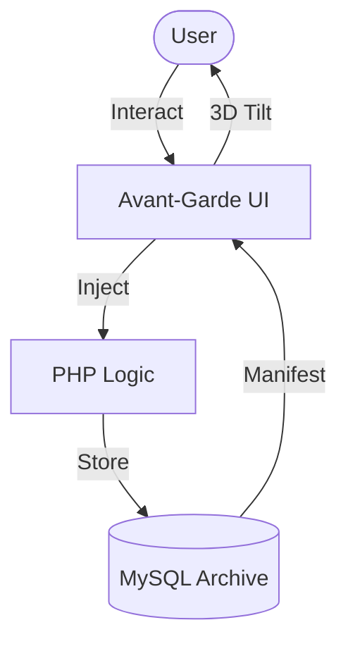

# THE V.O.I.D.

```text
 ________  ___  ___  _______           ___      ___  ________  ___  ________     
|\   __  \|\  \|\  \|\  ___ \         |\  \    /  /||\   __  \|\  \|\   ___ \    
\ \  \|\  \ \  \\\  \ \   __/|        \ \  \  /  / /\ \  \|\  \ \  \ \  \_|\ \   
 \ \   __  \ \   __  \ \  \_|/__       \ \  \/  / /  \ \  \\\  \ \  \ \  \ \\ \  
  \ \  \ \  \ \  \ \  \ \  \_|\ \       \ \    / /    \ \  \\\  \ \  \ \  \_\\ \ 
   \ \__\ \__\ \__\ \__\ \_______\       \ \__/ /      \ \_______\ \__\ \_______\
    \|__|\|__|\|__|\|__|\|_______|        \|__|/        \|_______|\|__|\|_______|
```

### Manifest your legacy. Never lose a thought to the void.

[](#)
[](#)
[](#)
[](#)

<p align="center">
  
</p>

---

## 🏔️ Why This Exists

Aplikasi catatan modern terlalu steril. Kita kehilangan koneksi emosional dengan ide-ide kita saat mereka dipenjara dalam antarmuka yang membosankan dan kaku. Pikiran Anda layak mendapatkan tempat yang megah—bukan sekadar baris dalam *database* yang dingin.

**THE V.O.I.D.** mengembalikan sensasi fisik ke dalam ruang digital. Setiap catatan adalah *fragment* memori yang hidup, bereaksi terhadap kehadiran Anda, dan memiliki berat visual yang nyata.

Itulah mengapa **THE V.O.I.D.** dibuat.

---

## 🔥 Fitur Unggulan

**🌊 Liquid Design Engine** — Antarmuka yang bermutasi secara organik.
Menggunakan filter SVG `feTurbulence` untuk menciptakan latar belakang aura yang hidup secara *real-time*.

**🛸 3D Spatial Awareness** — Interaksi fisik yang mendalam.
Setiap kartu catatan merespons posisi kursor Anda dengan transformasi *CSS 3D perspective* yang presisi.

**🎭 Typography Editorial** — Hierarki informasi tingkat tinggi.
Kombinasi ekstrem Syne (Sans) dan Cormorant Garamond (Serif) untuk dampak visual instan sekelas majalah *luxury*.

**🛡️ Vanta Security Architecture** — Otentikasi sepekat kegelapan.
Sistem login berbasis PHP murni dengan enkripsi *hash* dan visual *particle system* yang interaktif.

---

## ⚡ Quick Start

### Prerequisites
- **PHP** >= 8.1
- **MySQL** (Local server seperti Laragon/XAMPP)
- **Tailwind CLI** (Opsional, untuk kustomisasi aset)

### Install
```bash
# Clone repository
git clone https://github.com/your-username/the-archive.git

# Import database schema
mysql -u root -p notes_app < sql/database.sql
```

### Manifest Your First Thought
Cukup buka `localhost:8000`, daftar, dan injeksikan teks ke dalam *void*.

**Output yang Diharapkan:**
Kartu catatan akan muncul dengan animasi *staggered reveal* dan gambar dinamis yang ditarik dari Unsplash sesuai konteks ID.

---

## 🔧 Penggunaan Lengkap

### Level 1: Basic Archiving
Gunakan form di sisi kiri untuk menyimpan teks murni. Data akan langsung diproses oleh `db.php` dan dimanifestasikan di sisi kanan.

### Level 2: Interacting with Fragments
Arahkan kursor Anda. Perhatikan bagaimana kursor fisika (cincin merah) mengikuti gerakan Anda dan kartu catatan miring mengikuti perspektif kursor.

### Level 3: Advanced Customization
Modifikasi `input.css` dan jalankan *watcher* untuk mengubah estetika *aura*:
```bash
npx tailwindcss -i input.css -o output.css --watch
```



---

## 📖 API Reference

### `InjectThought(title, substance)`
Menyuntikkan data baru ke dalam sistem.

| Parameter | Tipe | Default | Deskripsi |
| :--- | :--- | :--- | :--- |
| `title` | `String` | `Untitled` | Identitas unik pikiran. |
| `substance` | `Text` | `-` | Isi utama dari memori. |

**Returns:** `Boolean` — Berhasil/Gagal manifestasi.

---

## 📊 Perbandingan

| Fitur | THE V.O.I.D. | Standard CRUD App |
| :--- | :---: | :---: |
| **Visual Fidelity** | 100% (Awwwards Style) | 20% (Bootstrap/Material) |
| **User Interaction** | 3D Spatial / Liquid | Static Lists |
| **Type Hierarchy** | Editorial Grade | Default Sans |
| **Aura/Atmosphere** | Active Aura | Flat Background |

---

## 🗺️ Roadmap

| ✅ Sudah Ada | 🔨 Sedang Dibangun | 💡 Dipertimbangkan |
| :--- | :--- | :--- |
| 3D Mouse Tracking | Mobile Grid Optimization | Collaboration Mode |
| Liquid SVG Filters | Offline PWA Support | AI Semantic Search |
| Glitch Text Effects | Markdown Support | End-to-End Encryption |

---

## 🤝 Contributing

Manifestasikan kontribusi Anda dengan setup cepat:
```bash
# Jalankan test PHP linting
php -l dashboard.php

# Gunakan Conventional Commits
git commit -m "feat: add magnetic hover effect to void-button"
```


---

## 📄 Footer
- **License**: [MIT License](LICENSE)
- **Author**: [AhnafZakhy3](https://github.com/AhnafZakhy3)
- **Acknowledgements**: Syne, Cormorant Garamond, JetBrains Mono, Unsplash API.

**Made with ❤️ by THE V.O.I.D. Maintainers**
*Manifest your legacy. Never lose a thought.*
